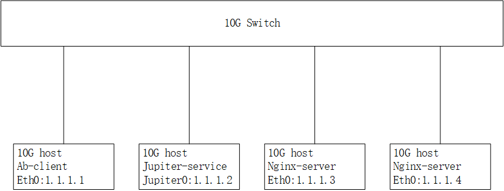
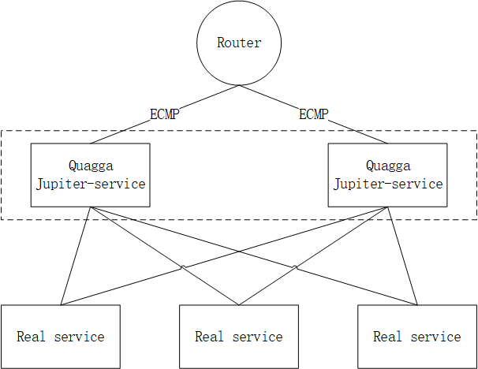

[English](README.md)

# Jupiter

## 项目简介

Jupiter是一个基于DPDK实现的高性能4层网络负载均衡服务，支持在fullnat工作模式下对TCP和UDP报文转发。jupiter支持的负载均衡算法包括[一致性哈希算法](https://www.codeproject.com/Articles/56138/Consistent-hashing)，轮询算法，最小连接数算法。

* 支持TCP, UDP协议
* 支持应用会话保持
* 支持负载均衡服务横向扩展
* 高性能，单机支持百万QPS
* 支持对访客IP限速，防止恶意流量

## 下载使用

### 1. 下载源码，编译安装RPM包

支持的OS发行版本: Centos-7.2或者Centos-7.4

```bash
tar -xf jupiter.tar.gz
cd jupiter
make rpm-pkg
rpm -i rpmbuild/RPMS/x86_64/jupiter-0.1-1.x86_64.rpm
```

### 2. 配置参数，启动服务

jupiter-service的默认配置文件路径是/etc/jupiter/jupiter.cfg，配置文件的一个例子如下：

EAL配置参数参考[DPDK文档](http://dpdk.org/doc/guides/testpmd_app_ug/run_app.html#eal-command-line-options).

```vim
[EAL]
cores = 1-3
memory = 4096,0
mem-channels = 4

[NETDEV]
name-prefix = jupiter
ip-local-address = 10.0.2.1, 10.0.2.2
kni-ipv4 = 1.1.1.2
kni-netmask = 255.255.255.0
kni-gateway = 1.1.1.254
```

配置hugepage:

```bash
echo 4096 > /sys/kernel/mm/hugepages/hugepages-2048kB/nr_hugepages
```

加载[IGB_UIO](http://dpdk.org/doc/guides/linux_gsg/linux_drivers.html)模块，为网卡绑定用户态驱动igb_uio：

```bash
modprobe uio
insmod /usr/share/jupiter/kmod/igb_uio.ko
/usr/share/jupiter/tools/dpdk-devbind.py --bind=igb_uio eth1
```

加载[KNI](http://dpdk.org/doc/guides/linux_gsg/enable_func.html#loading-the-dpdk-kni-kernel-module)模块:

```bash
insmod /usr/share/jupiter/kmod/rte_kni.ko
```

启动jupier-service进程:

```bash
jupiter-service --daemon
```

## 测试环境部署

### 1. 部署示意图如下



### 2. ab-client服务器配置

```bash
ifconfig eth0 1.1.1.1/24 up
route add -net 10.0.1.0 netmask 255.255.255.0 gw 1.1.1.2
```

### 3. nginx-server服务器配置

```bash
ifconfig eth0 1.1.1.3/24 up
route add -net 10.0.2.0 netmask 255.255.255.0 gw 1.1.1.2
```

### 4. jupiter-service服务器配置

配置虚拟TCP服务10.0.1.1：8888，并添加两个后端服务1.1.1.3:80和1.1.1.4：80. [关于描述配置命令的更多详细信息.](doc/command.md)

```bash
ifconfig jupiter0 1.1.1.2/24 up
jupiter-ctl vs/add 10.0.1.1:8888 tcp
jupiter-ctl rs/add 10.0.1.1:8888 tcp 1.1.1.3:80
jupiter-ctl rs/add 10.0.1.1:8888 tcp 1.1.1.4:80
```

### 5. ab-client访问vip

```bash
ab http://10.0.1.1:8888/
```

## 横向扩展



## 性能数据

CPU型号: Intel(R) Xeon(R) CPU E5-2698 v4 @ 2.20GHz

网卡型号: Intel Corporation 82599ES 10-Gigabit SFI/SFP+ Network Connection

Jmeter版本: apache-jmeter-3.1

Nginx版本: nginx-1.10.2

Bind版本: bind-9.9.4

Jupiter-service配置: 8个逻辑核, 4G内存

|协议类型|调度算法|TPS|ERROR|jupiter rx-pps|jupiter rx-bps|
|-|-|-|-|-|-|
|TCP|ipport|2064789.7|0|4.78M|8.41G|
|TCP|rr|2060283.5|0|4.78M|8.41G|
|TCP|lc|777078.5|0|-|-|
|UDP|ipport|4212952|0|8.28M|7.75G|
|UDP|rr|4272837.6|0|8.28M|7.75G|
|UDP|lc|812356.2|0|-|-|
